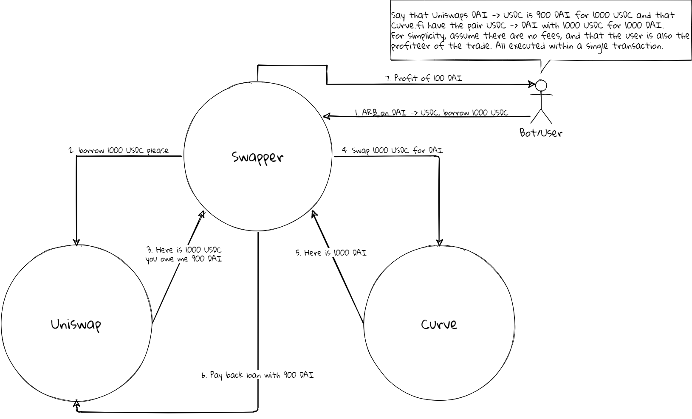

# ArbSwapper V2 - Arbitrage with Flash Swaps

The goal of this project is to utilise the concept flashswaps to execute arbitrage opportunities.

A flashswap is a special case of flashloan, where you borrow in one token and pay back in another, all within the same transaction. An example would be to borrow DAI and pay back in ETH at the end of the transaction. If the loan is not paid back, the entire transaction is reverted. In short, we either execute an arbitrage opportunity or we lose the fee we paid, if using flashbots, its will only be included in a block when there is a profit (and sufficient bribe is paid).

---

## Uniswap V2 flash swaps

The implementation here is using Uniswap V2 flashswaps to build a base for arbitrage bots. The main reason behind this, is that it is relatively easy to understand what is happening, so it is a fine way to understand what is going on.

One strategy could be to inherit from the `BaseSwapper` and perform arbitrage on Curve or perform liquidations on liquidity protocols etc.
Essentially a simplified flow is:

1. Borrow coin A from Uniswap
2. Use coin A for something that ends up with you holding coin B
3. Use coin B to pay Uniswap (practically satisfying K).

For the cases where there is no direct A/B pool, the implementation supports triangular flash swaps, which goes through `WETH` as an intermediate step. A/WETH -> WETH/B.

An example of a execution flow can be seen below, and uses an arbitrage opportunity at Curve as the execution step.

## Extension

The implementation can be extended with your strategy by inheriting from the `BaseSwapper` and overriding `BaseSwapper::execute()`. Access control and other shinanigans can be implemented on top as well if that is of interest.

An example just used for printing intermediate values is seen in `TestSwapper`.

---

# Be aware of the mempool monsters

While this contract is capable of performing arbitrage trades, the transaction needs to be first to take advantage of the trade. This is a huge issue, hence the mempool is full of predators just waiting for easy pray (thats your transaction). There is a number of articles that is way better at talking about this than I, some of them are here:

https://medium.com/@danrobinson/ethereum-is-a-dark-forest-ecc5f0505dff

https://samczsun.com/escaping-the-dark-forest/
